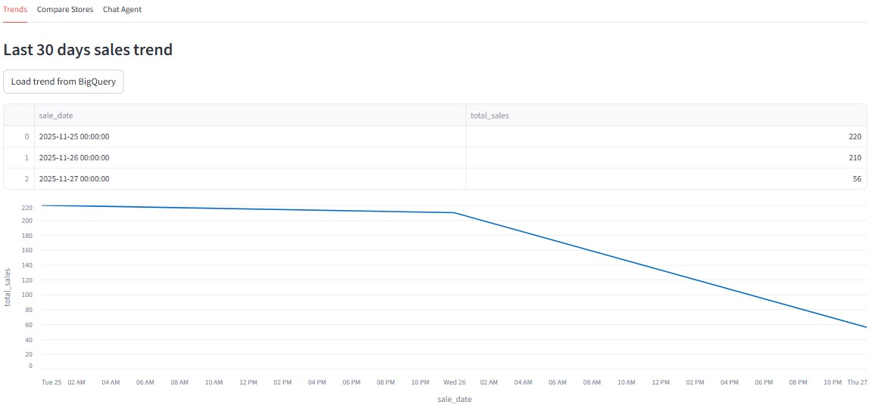
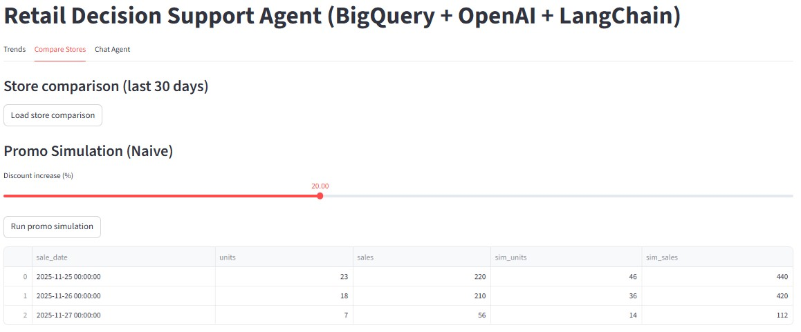
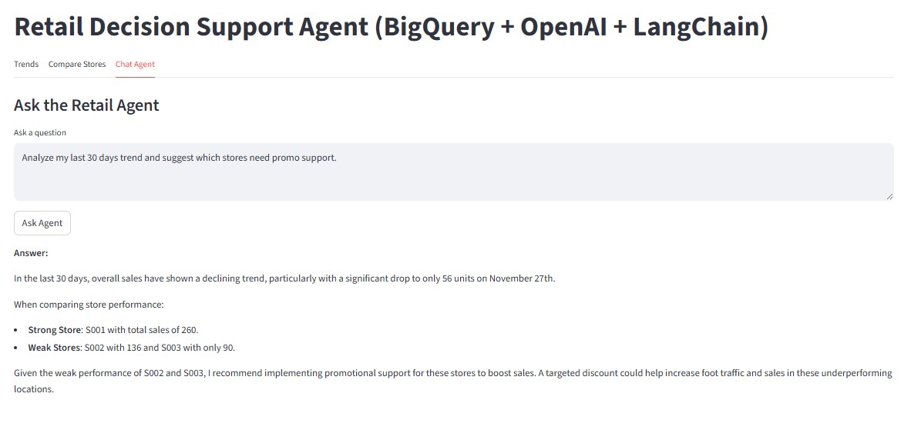

# Retail Decision Support Agent - Capstone Project

**GenAI + Agentic AI for CPG Retail Analytics** | BigQuery + LangChain + OpenAI + Streamlit

## Contents

- 1. Use Case & Problem Statement
- 2. Architecture and layers
- 3. Execution Flow
- 4. Interactive UI Screenshots
- 5. Key Takeaways

1. Use Case & Problem Statement

**Business Context:** A CPG (Consumer Packaged Goods) retailer operates multiple stores across regions, each selling hundreds of SKUs. They collect daily sales data across all stores, but:

- Decision-makers cannot explore data without writing SQL queries
- Manual analysis takes days, decisions are delayed
- No quick insights into which stores underperform or how promotions impact sales
- No intelligent recommendations – just raw numbers

##The Solution: Decision Support Agent

Build an AI Agent that:

- Understands natural language – Users ask questions in English
- Analyzes data automatically – Agent selects and runs appropriate tools
- Simulates scenarios – "What if I run a 15% promo?"
- Provides insights – LLM synthesizes data into actionable recommendations
- No SQL required – Non-technical business users can get answers instantly

## Expected Outcomes

| Metric | Benefit |
|--------|---------|
| Time to Insight| 1 hour : 30 seconds |
| User Base | SQL experts only : Any business user |
| Decision Quality | Manual gut feel : Data-driven + AI recommendations |
| Promo Effectiveness | Hit/miss : Targeted high-confidence recommendations |

# 2. Architecture

## High-Level Architecture

                    ┌──────────────────────┐
                    │         User         │
                    └──────────┬───────────┘
                               │
                               ▼
                    ┌──────────────────────┐
                    │   Streamlit UI       │
                    │  (3 Tabs + Chat)     │
                    └──────────┬───────────┘
                               │
                               ▼
                    ┌──────────────────────┐
                    │ LangChain Agent      │
                    │ (Tool Orchestrator)  │
                    └──────────┬───────────┘
                               │
         ┌─────────────────────┼─────────────────────┐
         │                     │                     │
         ▼                     ▼                     ▼
   ┌──────────────┐     ┌──────────────┐     ┌──────────────┐
   │ Trend Tool   │     │ Compare Tool │     │ Simulate Tool
   └──────┬───────┘     └──────┬───────┘     └──────┬───────┘
          │                    │                    │
          └────────────────────┼────────────────────┘
                               │
                               ▼
                    ┌──────────────────────┐
                    │  Data Layer          │
                    │  (BigQuery)          │
                    └──────────┬───────────┘
                               │
                               ▼
                    ┌──────────────────────┐
                    │     OpenAI LLM       │
                    │                      │
                    └──────────┬───────────┘
                               │
                               ▼
                    ┌──────────────────────┐
                    │  Business Answer     │
                    │  (Natural Language)  │
                    └──────────────────────┘

### 5 Core Layers::

# Layer 1: Data Layer 

| Component | Technology | Purpose |
|-----------|-----------|---------|
| Database | Google BigQuery  | Cloud data warehouse / mock data |
| Tables | Fact + Dimensions | Star schema (fact_sales, dims) |
| Query Language | SQL | Query sales data by date, store, SKU |

Data Model:
- fact_sales – Daily transactions (units, revenue, promo status)
- dim_store – Store metadata (city, region, format)
- dim_sku – Product info (category, brand, pack size)
- dim_date – Calendar dimensions (year, month, day)

# Layer 2: Tool Layer 

| Tool Function | What It Does | Returns |
|--------------|-------------|---------|
| analyze_trends_last_30_days() | Aggregates daily sales trend | Pandas DataFrame |
| compare_stores_last_30_days() | Groups sales by store, ranks | Pandas DataFrame |
| simulate_promo_uplift(discount_pct) | Applies elasticity model | DataFrame w/ simulated values |

# Layer 3: Agent Layer 

| Aspect | Details |
|--------|---------|
| Framework | LangChain (ReAct loop) |
| Agent Type | ZERO_SHOT_REACT_DESCRIPTION |
| LLM | ChatOpenAI (gpt-4o-mini) |
| Decision Logic | Reason -> Act -> Observe -> Repeat |

Agent Flow:
1. Parse user question in natural language
2. Decide which tools are needed
3. Execute tools with appropriate parameters
4. Aggregate results into structured format
5. Pass to LLM for synthesis

# Layer 4: GenAI Layer 

| Feature | Details |
|---------|---------|
| Model| OpenAI GPT-4o-mini |
| Task | Natural language synthesis + recommendations |
| Input | Raw data from tools (markdown tables) |
| Output | Business-friendly answer + actionable insights |

# Layer 5: UI Layer 

| Component | Technology | Features |
|-----------|-----------|----------|
| Frontend| Streamlit | Interactive web app |
| Layout | 3 Tabs | Trends, Compare Stores, Chat Agent |
| Visualizations| Streamlit Charts + Tables | Line charts, dataframes, markdown |

### 3. Execution Flow

# End-to-End User Journey

# Example User Question
Based on last 30 days, which stores should get promo support 
and what discount would you recommend?

## Step-by-Step Execution

| Step | Component | Action | Output |
|------|-----------|--------|--------|
| 1 | User | Types question in Chat tab | Text input captured |
| 2 | Streamlit | Calls run_agent(question) | Passes to backend |
| 3 | Agent | Parses question, picks tools | Decision: compare_stores + trend |
| 4 | Tools | Execute functions in parallel | Both return Pandas DataFrames |
| 5 | Agent | Aggregate DataFrames to markdown | Formatted table summary |
| 6 | LLM | Reads markdown, synthesizes answer | Business insight + recommendation |
| 7 | UI | Displays LLM response in chat | User sees final insight |

##  Execution Diagram

┌─────────────────┐
│  User Question  │
│ "Which stores   │
│  need promo?"   │
└────────┬────────┘
         │
         ▼
┌─────────────────────────────────┐
│  LangChain Agent (ReAct Loop)   │
│  ┌──────────────────────────┐   │
│  │ 1. Parse question        │   │
│  │ 2. Select tools needed   │   │
│  │ 3. Call tool             │   │
│  │ 4. Aggregate results     │   │
│  └──────────────────────────┘   │
└────────┬────────────────────────┘
         │
    ┌────┴────────────┬──────────┐
    │                 │          │
    ▼                 ▼          ▼
┌─────────┐   ┌────────────┐   ┌──────────┐
│ Trend   │   │  Compare   │   │ Other    │
│ Tool    │   │  Stores    │   │ Tools    │
└────┬────┘   └─────┬──────┘   └─────┬────┘
     │              │               │
     └──────────────┼───────────────┘
                    │
                    ▼
            Data Layer (SQL)
                    │
          ┌─────────┴──────────┐
          │                    │
          ▼                    ▼
     Pandas DF 1         Pandas DF 2
          │                    │
          └─────────┬──────────┘
                    │
                    ▼
    ┌──────────────────────────┐
    │  OpenAI LLM              │
    │  (Synthesis + Context)   │
    └─────────────┬────────────┘
                  │
                  ▼
    ┌──────────────────────────┐
    │  Business Answer         │
    │  + Recommendations       │
    └─────────────┬────────────┘
                  │
                  ▼
        Streamlit Chat Display

### File 4: app/ui_streamlit.py – Interactive UI

Purpose: Provide 3-tab interface for users

 Screenshots

-
## Tab 1: Trends Analysis 

- Last 30 days daily sales data in table format
- Line chart visualization showing sales trend over time
- Load button to fetch data from source

Business Value:
- Quickly identify if sales are trending up/down/stable
- Spot seasonal patterns or anomalies
- No SQL writing required

## Tab 2 : Promo Simulation

- Interactive slider to adjust discount percentage
- Simulated results showing units and sales impact
- Side-by-side comparison of base vs simulated values

Business Value:
- Test promo strategies **before** rolling out
- Estimate revenue impact of discount decisions
- Find optimal discount sweet spot

---

## Tab 3: Chat Agent

- User question in text area:  Analyze my last 30 days trend and
suggest which stores need promo support 
- Agent's natural language response with detailed analysis
- Actionable recommendations (not just raw numbers)

Business Value:
- Ask any business question in plain English
- Get instant insights with reasoning
- Combines data analysis + AI recommendations
- No technical skills required

### 5. Key Takeaways

| Concept | How It's Shown |
|---------|----------------|
| Agentic AI | LangChain agent dynamically selects & executes tools |
| GenAI Integration| OpenAI LLM synthesizes data into business insights |
| Tool Design| Clean separation: tools do data processing, LLM adds context |
| User Experience | Streamlit makes complex AI accessible to business users |
| Scalability | Architecture supports adding new tools & data sources |

Old Approach: SQL query -> raw numbers -> manual interpretation (hours)  
New Approach:* Question -> Agent -> automatic insight (seconds)

## Why This Matters for Data Engineers
Tool Design: Decouples business logic from orchestration  
Scalability: Easy to add new tools without changing agent  
Flexibility: Same agent works with BigQuery,  CSV, or APIs  
Observability: Verbose logging shows agent's reasoning  
Production-Ready: Error handling, retry logic, cost tracking  

